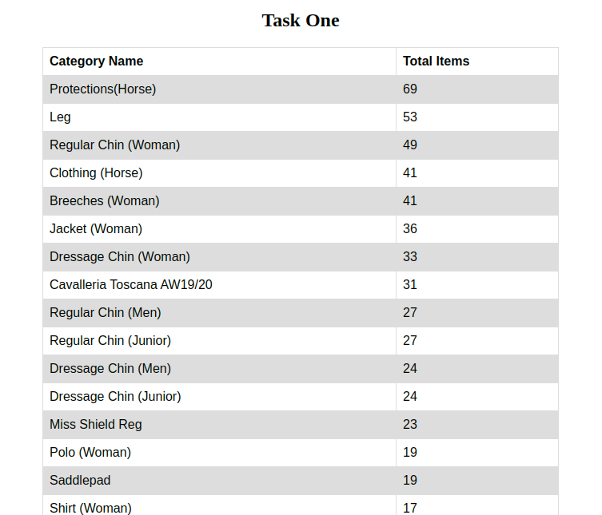

# php-practical-test quick start

These are the quick steps to run `php-practical-test` project

Requirements
============
* PHP
* mysql-server

## Installation
- `git clone https://github.com/NazmusShakib/php-practical-test.git`
- `cd php-practical-test`

**Make sure you set the correct database information before running**
>> Need to set the database credential at: includes/DB.inc.php

Start the local development php server

    php -S localhost:8000

You can now access the server at http://localhost:8000

#### URL- [127.0.0.1:8000](http://127.0.0.1:8000)

**TL;DR command list**

    git clone https://github.com/NazmusShakib/php-practical-test.git
    cd php-practical-test
    php -S localhost:8000

## Screenshot

## Questions and Improvements

For any question or emprovement please send an e-mail to Nazmus Shakib [nshakib.se@gmail.com](mailto:nshakib.se@gmail.com).

